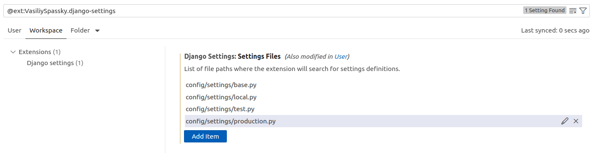
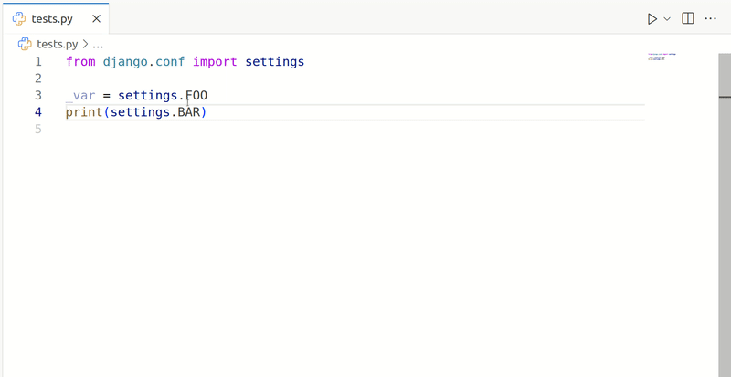

## Configuration

Set `djangoSettings.settingsFiles` to the list of paths where to look for the settings definitions. The paths must be
relative to the workspace root.

Example in `settings.json`:

```json
"djangoSettings.settingsFiles": [
    "config/settings/base.py",
    "config/settings/local.py",
    "config/settings/test.py",
    "config/settings/production.py"
]
```

Example in the VSCode settings GUI:



## Features

### Go to definition

Tired of "Go to definition" on the `settings` object taking you to `django.conf._DjangoConfLazyObject.__gettattr__`?


